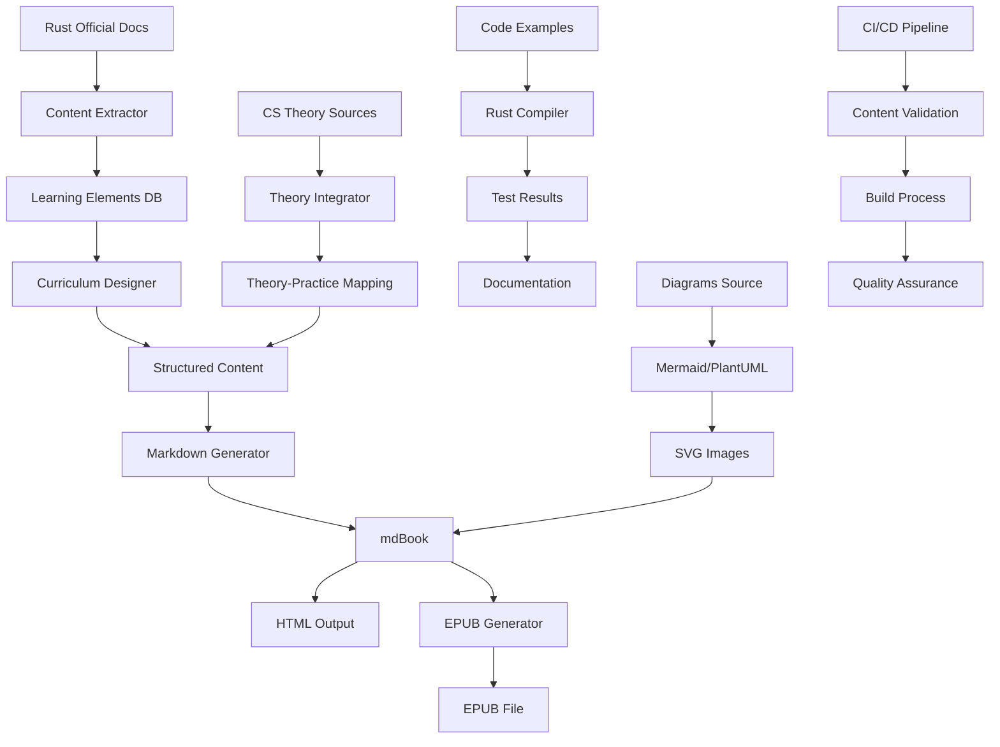
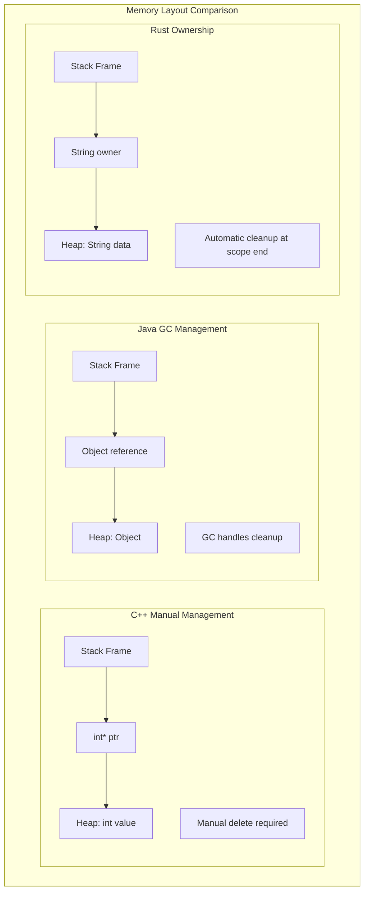
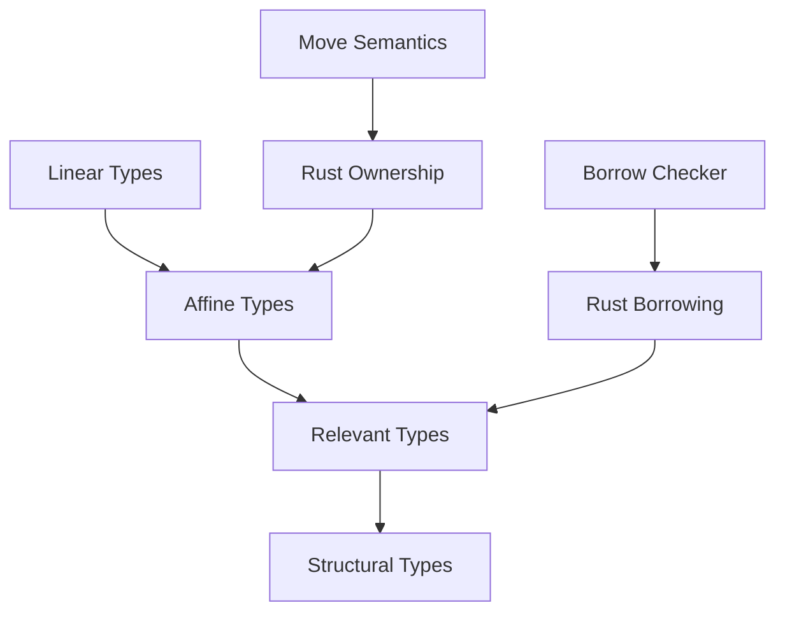

# Design Document

## Overview

Rust公式ドキュメントから学習要素を網羅的に抽出し、コンピューターサイエンスの理論的基盤と組み合わせた包括的なRust学習書籍プロジェクトの設計書です。本プロジェクトは、mdBookを基盤とした静的サイト生成システムを使用し、公式ドキュメントの構造化された分析、理論的背景の説明、実行可能なコード例を統合したMarkdownコンテンツからHTML及びEPUB形式の書籍を生成します。既存のRust書籍では不足している深い理解を提供することを目標とします。

## Architecture

### システム構成



### 技術スタック

- **コンテンツ抽出**: Python/Rust scripts for official docs parsing
- **学習要素管理**: YAML/JSON for structured curriculum data
- **理論統合**: LaTeX for mathematical notation, Markdown for text
- **コンテンツ生成**: Markdown + mdBook
- **図表生成**: Mermaid.js, PlantUML, TikZ for CS diagrams
- **EPUB生成**: Pandoc + mdBook-epub
- **コード実行**: Rust Playground integration + local testing
- **CI/CD**: GitHub Actions with content validation
- **バージョン管理**: Git with structured branching for content types

## Components and Interfaces

### 1. 公式ドキュメント分析システム

**責任**: Rust公式ドキュメントからの学習要素抽出と構造化

**対象ドキュメント**:
- The Rust Programming Language (The Book)
- The Rust Reference
- The Rustonomicon (Unsafe Rust)
- Standard Library Documentation
- Rust by Example
- The Cargo Book
- The rustc Book

**抽出データ構造**:
```yaml
learning_elements:
  - id: "ownership_basic"
    source: "the_book"
    chapter: "4"
    title: "Understanding Ownership"
    concepts:
      - "ownership_rules"
      - "move_semantics"
      - "copy_trait"
    prerequisites: ["variables", "functions"]
    difficulty: "beginner"
    cs_theory: ["memory_management", "resource_management"]
  
  - id: "lifetimes_advanced"
    source: "rustonomicon"
    chapter: "3"
    title: "Lifetime Subtyping"
    concepts:
      - "variance"
      - "higher_ranked_trait_bounds"
    prerequisites: ["lifetimes_basic", "traits"]
    difficulty: "advanced"
    cs_theory: ["type_theory", "subtyping"]
```

### 2. カリキュラム設計システム

**責任**: 抽出された学習要素の依存関係分析と学習順序の決定

**アルゴリズム**:
- トポロジカルソートによる依存関係解決
- 難易度レベルによる段階的構成
- コンピューターサイエンス理論との対応付け

**出力構造**:
```yaml
curriculum:
  part1_foundations:
    title: "基礎理論とRustの基本"
    chapters:
      - cs_memory_model
      - rust_ownership_intro
      - rust_borrowing_basic
  
  part2_type_system:
    title: "型システムと安全性"
    chapters:
      - type_theory_basics
      - rust_type_system
      - generics_and_traits
  
  part3_advanced:
    title: "高度な概念と実装"
    chapters:
      - lifetime_theory
      - unsafe_rust
      - concurrency_theory
```

### 3. 理論統合システム

**責任**: コンピューターサイエンス理論とRust実装の結びつけ

**理論カテゴリ**:
- **メモリ管理理論**: Stack/Heap, Allocation strategies, GC algorithms
- **型理論**: Type safety, Type inference, Subtyping
- **並行性理論**: Race conditions, Synchronization primitives, Actor model
- **プログラミング言語理論**: Ownership types, Linear types, Affine types

**統合フォーマット**:
```markdown
## 理論的背景: 所有権型システム

### コンピューターサイエンスの観点

所有権型システム（Ownership Type System）は、プログラミング言語理論において...

```math
\frac{\Gamma \vdash e : \tau \quad \text{own}(\tau)}{\Gamma \vdash e : \text{owned } \tau}
```

### Rustでの実装

Rustの所有権システムは上記の理論を以下のように実装しています：

```rust
fn demonstrate_ownership() {
    let s = String::from("hello"); // s owns the String
    takes_ownership(s);             // s's value moves into the function
    // s is no longer valid here
}
```

### 他言語との比較

- **C++**: RAII pattern, but manual memory management
- **Java**: Garbage collection, no explicit ownership
- **Rust**: Compile-time ownership checking
```

### 4. コンテンツ管理システム

**責任**: 統合されたコンテンツの管理と書籍生成

**ファイル構造**:
```
rust-comprehensive-book/
├── content_extraction/
│   ├── official_docs_parser.py
│   ├── learning_elements.yaml
│   └── curriculum_generator.py
├── theory_integration/
│   ├── cs_theory/
│   │   ├── memory_management.md
│   │   ├── type_theory.md
│   │   └── concurrency_theory.md
│   └── theory_rust_mapping.yaml
├── book_content/
│   ├── book.toml
│   ├── SUMMARY.md
│   └── src/
│       ├── part1_foundations/
│       ├── part2_type_system/
│       └── part3_advanced/
└── assets/
    ├── diagrams/
    └── code_examples/
```

**book.toml設定**:
```toml
[book]
title = "Rust完全理解: 公式ドキュメント網羅とコンピューターサイエンス理論"
authors = ["Author Name"]
language = "ja"
description = "Rust公式ドキュメントを網羅し、CS理論と結びつけた包括的学習書"

[build]
build-dir = "book"

[output.html]
default-theme = "navy"
git-repository-url = "https://github.com/user/rust-comprehensive-book"
mathjax-support = true

[output.epub]
cover-image = "assets/cover.png"
additional-css = ["assets/epub.css", "assets/math.css"]

[preprocessor.index]
boilerplate = "This book comprehensively covers Rust based on official documentation and CS theory"

[preprocessor.links]
# Official documentation cross-references
```

### 5. コード例管理システム

**責任**: 理論と実装を結びつける実行可能なRustコードの管理

**構造**:
```
code_examples/
├── foundations/
│   ├── memory_model/
│   │   ├── stack_heap_demo.rs
│   │   ├── allocation_strategies.rs
│   │   └── memory_layout.rs
│   ├── ownership_theory/
│   │   ├── ownership_rules.rs
│   │   ├── move_semantics.rs
│   │   └── copy_vs_move.rs
│   └── borrowing_system/
├── type_system/
│   ├── type_safety/
│   ├── generics_theory/
│   └── trait_system/
├── advanced_concepts/
│   ├── lifetime_theory/
│   ├── unsafe_rust/
│   └── concurrency/
└── comparative_examples/
    ├── rust_vs_cpp/
    ├── rust_vs_java/
    └── rust_vs_haskell/
```

**コード例の標準構造**:
```rust
//! # 所有権システムの理論的実装
//! 
//! ## 理論的背景
//! 所有権型システムは線形型理論に基づいており...
//! 
//! ## 公式ドキュメント参照
//! - The Book Chapter 4: Understanding Ownership
//! - Reference: Ownership and moves
//! 
//! ## 学習目標
//! - [ ] 所有権の3つのルールを理解する
//! - [ ] moveセマンティクスを説明できる
//! - [ ] 他言語との違いを説明できる

use std::mem;

/// 所有権の基本的な動作を示すデモ
/// 
/// # 理論的説明
/// この関数は所有権の移動（move）を実演します。
/// 線形型理論では、リソースは正確に一度だけ使用されます。
fn demonstrate_ownership_theory() {
    println!("=== 所有権理論の実演 ===");
    
    // 1. 所有権の作成
    let s1 = String::from("hello");
    println!("s1 created: {}", s1);
    println!("s1 memory address: {:p}", s1.as_ptr());
    
    // 2. 所有権の移動（move semantics）
    let s2 = s1; // s1の所有権がs2に移動
    println!("s2 after move: {}", s2);
    println!("s2 memory address: {:p}", s2.as_ptr());
    
    // println!("s1: {}", s1); // コンパイルエラー！s1はもう有効ではない
    
    // 3. 他言語との比較
    demonstrate_cpp_equivalent();
    demonstrate_java_equivalent();
}

/// C++での等価な動作（参考）
fn demonstrate_cpp_equivalent() {
    println!("\n=== C++での等価な動作 ===");
    println!("std::string s1 = \"hello\";");
    println!("std::string s2 = std::move(s1); // 明示的なmove");
    println!("// s1は未定義状態");
}

/// Javaでの等価な動作（参考）
fn demonstrate_java_equivalent() {
    println!("\n=== Javaでの等価な動作 ===");
    println!("String s1 = \"hello\";");
    println!("String s2 = s1; // 参照のコピー");
    println!("// s1とs2は同じオブジェクトを参照");
}

fn main() {
    demonstrate_ownership_theory();
    
    // メモリ使用量の表示
    print_memory_usage();
}

fn print_memory_usage() {
    println!("\n=== メモリ使用量情報 ===");
    println!("String size: {} bytes", mem::size_of::<String>());
    println!("&str size: {} bytes", mem::size_of::<&str>());
}

#[cfg(test)]
mod tests {
    use super::*;
    
    #[test]
    fn test_ownership_move() {
        let s1 = String::from("test");
        let s2 = s1;
        assert_eq!(s2, "test");
        // s1はもう使用できない
    }
    
    #[test]
    fn test_memory_layout() {
        let s = String::from("hello");
        assert_eq!(mem::size_of_val(&s), mem::size_of::<String>());
    }
}
```

### 6. 図表生成システム

**責任**: 理論的概念とRust実装の視覚化

**図表カテゴリ**:

1. **メモリ管理図表**:
   - メモリ階層構造
   - Stack/Heap allocation patterns
   - Garbage collection vs ownership comparison

2. **型システム図表**:
   - Type hierarchy diagrams
   - Generic type resolution
   - Trait object memory layout

3. **並行性図表**:
   - Thread synchronization patterns
   - Message passing diagrams
   - Race condition illustrations

4. **理論的概念図表**:
   - Linear type system visualization
   - Ownership type rules
   - Lifetime variance diagrams

**高度な図表例**:



**型理論の視覚化**:


### 4. EPUB生成システム

**責任**: HTML出力からEPUB形式への変換

**設定**:
```toml
[output.epub]
cover-image = "assets/cover.png"
additional-css = ["assets/epub.css"]
curly-quotes = true
```

**変換プロセス**:
1. mdBookでHTML生成
2. Pandocでメタデータ処理
3. 画像・CSS調整
4. EPUB3形式で出力

## Data Models

### 統合章構造モデル

```markdown
# 章タイトル: 所有権システムの理論と実装

## 公式ドキュメント参照
- **The Book**: Chapter 4 - Understanding Ownership
- **Reference**: Section 4.1 - Ownership and moves
- **Rustonomicon**: Chapter 3 - Ownership and Lifetimes

## 理論的背景

### コンピューターサイエンスの観点
線形型理論（Linear Type Theory）において...

```math
\frac{\Gamma \vdash e : \tau \quad \text{linear}(\tau)}{\Gamma \vdash e : \text{use-once } \tau}
```

### 他言語での実装
- **C++**: RAII pattern, std::unique_ptr
- **Haskell**: Linear types extension
- **Rust**: Compile-time ownership checking

## Rustでの実装

### 基本概念
```rust
// 理論を実装したコード例
fn ownership_demo() {
    let s = String::from("hello"); // 所有権の作成
    takes_ownership(s);             // 所有権の移動
    // s はここでは無効
}
```

### 実行結果と解説
```
所有権が正常に移動されました
メモリは自動的に解放されます
```

## 段階的理解

### レベル1: 基本理解
- [ ] 所有権の3つのルール
- [ ] moveセマンティクス

### レベル2: 応用理解  
- [ ] 借用との関係
- [ ] ライフタイムとの連携

### レベル3: 理論的理解
- [ ] 線形型理論との対応
- [ ] 型システムでの位置づけ

## 実践演習
1. 基本的な所有権の移動
2. 他言語との比較実装
3. パフォーマンス測定

## 発展的トピック
- 次章: 借用システムの理論
- 関連: ライフタイム推論
- 応用: 並行プログラミングでの所有権
```

### 拡張メタデータモデル

```yaml
chapter:
  id: "ownership_theory_implementation"
  number: 4
  title: "所有権システムの理論と実装"
  
  official_sources:
    - source: "the_book"
      chapters: ["4"]
      sections: ["4.1", "4.2"]
    - source: "reference"
      sections: ["4.1"]
    - source: "rustonomicon"
      chapters: ["3"]
  
  cs_theory:
    primary: "linear_type_theory"
    secondary: ["resource_management", "memory_safety"]
    mathematical_notation: true
    
  learning_objectives:
    basic:
      - "所有権の3つのルールを説明できる"
      - "moveセマンティクスを理解する"
    intermediate:
      - "他言語との違いを説明できる"
      - "パフォーマンスへの影響を理解する"
    advanced:
      - "線形型理論との関係を説明できる"
      - "型システムでの位置づけを理解する"
  
  prerequisites:
    rust_concepts: ["variables", "functions", "data_types"]
    cs_concepts: ["memory_model", "type_systems"]
    
  estimated_time:
    reading: "45分"
    exercises: "60分"
    total: "105分"
    
  difficulty: "intermediate"
  
  code_examples:
    - "ownership_basic.rs"
    - "ownership_vs_cpp.rs"
    - "ownership_performance.rs"
    
  diagrams:
    - "ownership_memory_layout.mermaid"
    - "linear_types_hierarchy.mermaid"
    - "language_comparison.plantuml"
    
  exercises:
    - type: "implementation"
      difficulty: "basic"
      file: "exercises/ownership_basic.rs"
    - type: "analysis"
      difficulty: "intermediate"
      file: "exercises/ownership_analysis.md"
    - type: "theory"
      difficulty: "advanced"
      file: "exercises/ownership_theory.md"
```

### 学習要素データベースモデル

```yaml
learning_elements_db:
  concepts:
    ownership:
      id: "ownership"
      official_sources:
        - "the_book:4"
        - "reference:4.1"
      theory_background: "linear_type_theory"
      dependencies: ["variables", "functions"]
      implementations: ["move_semantics", "drop_trait"]
      
    borrowing:
      id: "borrowing"
      official_sources:
        - "the_book:4.2"
        - "reference:4.2"
      theory_background: "affine_type_theory"
      dependencies: ["ownership"]
      implementations: ["immutable_borrow", "mutable_borrow"]
      
  theory_mappings:
    linear_type_theory:
      concepts: ["ownership", "move_semantics"]
      mathematical_foundation: true
      external_resources:
        - "Types and Programming Languages - Pierce"
        - "Linear Logic - Girard"
        
    memory_management:
      concepts: ["stack_allocation", "heap_allocation", "raii"]
      practical_focus: true
      comparison_languages: ["cpp", "java", "python"]
```

## Error Handling

### ビルドエラー処理

1. **Rustコードエラー**:
   - コンパイルエラーの自動検出
   - エラーメッセージの日本語化
   - 修正提案の表示

2. **図表生成エラー**:
   - Mermaid構文エラーの検出
   - 代替表示の提供
   - ログ出力による診断

3. **EPUB生成エラー**:
   - メタデータ不整合の検出
   - 画像リンク切れの確認
   - フォーマット検証

### エラー報告システム

```rust
#[derive(Debug)]
enum BookBuildError {
    CodeCompilationError { chapter: String, error: String },
    DiagramGenerationError { file: String, error: String },
    EpubConversionError { stage: String, error: String },
}

impl BookBuildError {
    fn user_friendly_message(&self) -> String {
        match self {
            Self::CodeCompilationError { chapter, error } => {
                format!("第{}章のコード例でエラーが発生しました: {}", chapter, error)
            }
            // 他のエラータイプの処理
        }
    }
}
```

## Testing Strategy

### 1. コード例テスト

```rust
#[cfg(test)]
mod tests {
    use super::*;

    #[test]
    fn test_ownership_example() {
        // 各コード例が正常に動作することを確認
        assert!(ownership_demo().is_ok());
    }

    #[test]
    fn test_memory_safety() {
        // メモリ安全性の確認
        // コンパイル時エラーが期待される場合のテスト
    }
}
```

### 2. ドキュメントテスト

```bash
# mdBookのテスト機能を使用
mdbook test

# Rustのdoctestを実行
cargo test --doc
```

### 3. EPUB品質テスト

```bash
# EPUBファイルの検証
epubcheck output.epub

# アクセシビリティチェック
ace output.epub
```

### 4. CI/CDパイプライン

```yaml
name: Book Build and Test

on: [push, pull_request]

jobs:
  test:
    runs-on: ubuntu-latest
    steps:
      - uses: actions/checkout@v2
      - name: Setup Rust
        uses: actions-rs/toolchain@v1
      - name: Test code examples
        run: cargo test
      - name: Build book
        run: mdbook build
      - name: Generate EPUB
        run: mdbook-epub
      - name: Validate EPUB
        run: epubcheck book.epub
```

### 5. 品質保証

- **コード品質**: Clippy, Rustfmt
- **ドキュメント品質**: 日本語校正ツール
- **アクセシビリティ**: EPUB Accessibility checker
- **パフォーマンス**: ビルド時間の監視